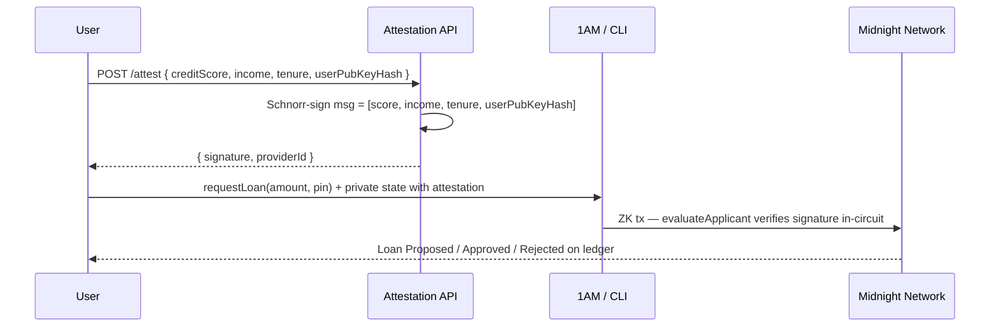

# Midnight Network ZK Loan Application

A **privacy-preserving loan dApp** where applicants prove eligibility inside a ZK circuit without revealing credit score, income, or tenure on-chain. A trusted **attestation provider** signs credit data off-chain; the contract verifies the Schnorr signature in-circuit and writes only the **loan outcome** (status + authorized amount) to the ledger.

**What this skill produces:**
- `contract/` — `schnorr.compact` + `zkloan-credit-scorer.compact`, witnesses, compile scripts
- `zkloan-credit-scorer-attestation-api/` — REST server that Schnorr-signs credit profiles
- `zkloan-credit-scorer-cli/` — deploy, register providers, request/respond to loans (headless wallet)
- `app/loan/` *(optional)* — Next.js + 1AM wallet UI (copy patterns from `templates/leaderboard-dapp/`)
- `lib/zkloan.ts` — deploy, `requestLoan`, `respondToLoan`, admin calls, ledger decode
- `lib/midnight.ts` — wallet session + patched indexer provider (**copy from** `references/midnight-session.md`)
- `public/zk/zkloan/` — ZK proving assets synced from contract build

**Shared references** (canonical provider + troubleshooting — do not duplicate in prompts):
- `references/midnight-session.md` — `createConnectedSession`, indexer patch, deploy/call helpers
- `references/gotchas.md` — preprod deploy hangs, GraphQL `offset: null`, ZK asset paths
- `references/versions.json` — pinned `@midnight-ntwrk/*` versions

**Primary references:**
- `example-leaderboard-dapp/` / `templates/leaderboard-dapp/` — Next.js + 1AM, low-level deploy/call, indexer reads
- `example-locker-dapp/` — witness private state, `createUnprovenDeployTx` + `submitTxAsync`
- `example-counter/` — headless CLI wallet, monorepo workspaces, vitest contract tests
- `compact/` — `disclose()`, witnesses, `persistentHash`, `Map`, `Set`, `new type`, pure circuits
- `security/` — never trust `ownPublicKey()` for caller identity; witness-derived keys
- `indexer/` — read public loan ledger without wallet

**Key architecture notes:**
- Credit score, income, tenure, and attestation signature stay **private** (witness only)
- Only loan status + authorized amount + derived user pubkey bytes appear on-chain
- **Never use `ownPublicKey()`** for auth — it is prover-supplied and bypassable; derive identity from `getUserSecret()` witness + PIN via `deriveUserPublicKey` / `deriveAdminPublicKey`
- Attestation binds to `transientHash(userPubKeyBytes)` inside `evaluateApplicant`
- Eligibility tiers: ≥700 + ≥$2k + ≥24mo → $10k; ≥600 + ≥$1.5k → $7k; ≥580 → $3k; else rejected
- `requestLoan` may return **Proposed** when amount exceeds tier max — user calls `respondToLoan` to accept/decline
- PIN change migrates loans in batches of 5 via `changePin` + `onGoingPinMigration` ledger map
- Use `createUnprovenDeployTx` + `submitTxAsync` — not `deployContract()` (hangs on preprod)
- **Node.js ≥ 22** required for `@midnight-ntwrk/wallet-sdk-shielded` (Iterator helpers on `Map.values()`)

---

## Workflow

When helping the user, follow this sequence:

1. **Monorepo** — root `package.json` workspaces: `contract`, `attestation-api`, `cli`
2. **Contract** — compile Compact (`schnorr.compact` + `zkloan-credit-scorer.compact`) + witnesses
3. **Attestation API** — generate/load provider Jubjub keypair; sign credit profiles; expose REST endpoint
4. **Deploy** — CLI or browser: low-level deploy, persist `userSecretKey` + contract address in private state
5. **Register provider** — admin calls `registerProvider(providerId, providerPk)` on-chain
6. **Request loan** — fetch attestation → populate private state → `requestLoan(amount, secretPin)`
7. **Respond** — if status is `Proposed`, call `respondToLoan(loanId, secretPin, accept)`
8. **Read state** — indexer GraphQL → decode `loans` nested map (public)
9. **Frontend** *(optional)* — connect 1AM, deploy/join, loan form, loan table, admin panel

---

## 1) Monorepo Structure

```
zkloan-credit-scorer/
├── package.json                    # workspaces + pinned midnight-js 4.0.4 / ledger 8.0.3
├── .nvmrc                          # 22
├── contract/
│   ├── package.json
│   └── src/
│       ├── schnorr.compact
│       ├── zkloan-credit-scorer.compact
│       ├── witnesses.ts
│       ├── index.ts
│       └── managed/zkloan-credit-scorer/   # compiler output (gitignored)
├── zkloan-credit-scorer-attestation-api/
│   └── src/                        # Express/Fastify REST — sign credit profiles
├── zkloan-credit-scorer-cli/
│   └── src/                        # deploy, register-provider, request-loan, admin
└── zkloan-dapp/                    # optional Next.js frontend
    ├── lib/midnight.ts             # copy from templates/leaderboard-dapp
    ├── lib/zkloan.ts
    ├── app/loan/LoanClient.tsx
    ├── contract/                   # symlink or workspace import from ../contract
    ├── scripts/sync-zk-assets.mjs
    └── public/zk/zkloan/
```

Root `package.json` engines: `"node": ">=22.0.0"`. Workspaces pin `@midnight-ntwrk/compact-runtime: ^0.16.0`, `@midnight-ntwrk/midnight-js-*: 4.0.4`, `@midnight-ntwrk/ledger-v8: 8.0.3`.

---

## 2) Compact Contract

### Schnorr module (`contract/src/schnorr.compact`)

Verifies Jubjub Schnorr signatures inside the circuit. Temporary polyfill until `jubjubSchnorrVerify` ships in Compact Standard Library.

```compact
module schnorr {
  import CompactStandardLibrary;
  export struct SchnorrSignature { announcement: JubjubPoint; response: Field; }
  witness getSchnorrReduction(challengeHash: Field): [Field, Uint<248>];
  export circuit schnorrVerify<#n>(msg: Vector<n, Field>, signature: SchnorrSignature, pk: JubjubPoint): [] { /* ... */ }
  export pure circuit schnorrChallenge(...): Field { /* transientHash challenge */ }
}
```

**JubjubPoint equality:** compare `jubjubPointX()` / `jubjubPointY()` — struct `==` is reference equality and always fails for fresh points.

### Main contract (`contract/src/zkloan-credit-scorer.compact`)

```compact
pragma language_version >= 0.22 && <= 0.23;
import CompactStandardLibrary;
import "schnorr" prefix Schnorr_;

export enum LoanStatus { Approved, Rejected, Proposed, NotAccepted }
export struct LoanApplication { authorizedAmount: Uint<16>; status: LoanStatus; }

export new type UserSecretKey = Bytes<32>;
export new type UserPublicKey = Bytes<32>;
export new type AdminPublicKey = Bytes<32>;

export ledger blacklist: Set<UserPublicKey>;
export ledger loans: Map<Bytes<32>, Map<Uint<16>, LoanApplication>>;
export ledger onGoingPinMigration: Map<Bytes<32>, Uint<16>>;
export ledger contractAdmin: AdminPublicKey;
export ledger providers: Map<Uint<16>, JubjubPoint>;

witness getAttestedScoringWitness(): [Applicant, Schnorr_SchnorrSignature, Uint<16>];
witness getUserSecret(): UserSecretKey;

export pure circuit deriveUserPublicKey(sk: UserSecretKey, pin: Uint<16>): UserPublicKey { /* persistentHash domain "zkloan:user:pk:v1" */ }
export pure circuit deriveAdminPublicKey(sk: UserSecretKey): AdminPublicKey { /* "zkloan:admin:pk:v1" */ }

export circuit requestLoan(amountRequested: Uint<16>, secretPin: Uint<16>): [] { /* ... */ }
export circuit respondToLoan(loanId: Uint<16>, secretPin: Uint<16>, accept: Boolean): [] { /* ... */ }
export circuit changePin(oldPin: Uint<16>, newPin: Uint<16>): [] { /* batched migration, 5 per tx */ }

// Admin (all guard with deriveAdminPublicKey(getUserSecret()) == contractAdmin)
export circuit blacklistUser(account: UserPublicKey): [] { /* ... */ }
export circuit registerProvider(providerId: Uint<16>, providerPk: JubjubPoint): [] { /* ... */ }
export circuit rotateAdmin(newAdmin: AdminPublicKey): [] { /* ... */ }
```

**Privacy boundary:**

| Data | Visibility |
|------|------------|
| Credit score, income, tenure | Private (witness) |
| Attestation signature | Private (ZK input) |
| User secret + PIN | Private (witness / circuit input) |
| Derived `UserPublicKey` (loan map key) | Public (ledger) |
| Loan status + authorized amount | Public (ledger) |
| `contractAdmin`, `providers`, `blacklist` | Public (ledger) |

Compile:

```bash
cd contract
npm run compact    # → src/managed/zkloan-credit-scorer/
npm run build
cd ..
```

For browser UI also run `npm run sync:assets` (copies keys/zkir → `public/zk/zkloan/`).

---

## 3) Witnesses

`contract/src/witnesses.ts`:

```typescript
export type ZKLoanCreditScorerPrivateState = {
  creditScore: bigint;
  monthlyIncome: bigint;
  monthsAsCustomer: bigint;
  attestationSignature: SchnorrSignature;
  attestationProviderId: bigint;
  userSecretKey: Uint8Array;   // 32 bytes — authoritative caller identity
};

export const witnesses = {
  getAttestedScoringWitness: (ctx) => [ctx.privateState, [profile, sig, providerId]],
  getSchnorrReduction: (ctx, challengeHash) => [ctx.privateState, [q, r]],  // challenge / 2^248
  getUserSecret: (ctx) => [ctx.privateState, ctx.privateState.userSecretKey],
};
```

Before `requestLoan`, TypeScript must:
1. Call attestation API with credit profile + user's derived pubkey hash
2. Store returned signature + provider ID in private state alongside credit fields
3. Ensure `userSecretKey` is 32 bytes (persist in `localStorage` or CLI keystore)

---

## 4) Attestation API

Trusted off-chain signer. Flow:



**Implementation checklist:**
- Generate Jubjub provider keypair at startup (or load from env)
- Compute challenge via contract's exported `pureCircuits.schnorrChallenge` (same hash as in-circuit)
- Sign with provider secret key; return `{ announcement, response }` + `providerId`
- Admin must `registerProvider(providerId, providerPk)` on-chain before any loan succeeds
- Bind attestation to `transientHash(deriveUserPublicKey(secret, pin))` — same hash the circuit uses

Example endpoint shape:

```typescript
// POST /attest
// body: { creditScore, monthlyIncome, monthsAsCustomer, userPubKeyHash: string }
// response: { providerId, signature: { announcement: { x, y }, response } }
```

Run locally (default port e.g. 3001):

```bash
cd zkloan-credit-scorer-attestation-api
npm run dev
```

---

## 5) CLI (headless wallet)

Mirror `example-counter/` CLI patterns:

| Command | Purpose |
|---------|---------|
| `deploy` | `createUnprovenDeployTx` → stores deployer as admin via constructor |
| `register-provider <id>` | Admin: on-chain provider pubkey from attestation API |
| `request-loan <amount> <pin>` | Fetch attestation → set private state → `requestLoan` |
| `respond-loan <id> <pin> accept\|decline` | Accept or decline `Proposed` loan |
| `list-loans` | Indexer read of public `loans` map for derived user key |
| `change-pin <old> <new>` | Repeat until `onGoingPinMigration` cleared |
| `blacklist-user <userPk>` | Admin governance |

Use `@midnight-ntwrk/wallet-sdk-facade` + level private state provider. Point at local proof server + preprod indexer from wallet config or `.env`.

---

## 6) TypeScript Integration (browser)

`lib/zkloan.ts` — same low-level pattern as `templates/leaderboard-dapp/lib/leaderboard.ts`:

| Function | Purpose |
|----------|---------|
| `getOrCreateUserSecret()` | Persist 32-byte secret in `localStorage` |
| `deriveUserPublicKey(session, pin)` | Call exported pure circuit off-chain |
| `fetchAttestation(apiUrl, profile, userPubKeyHash)` | POST to attestation API |
| `deployZkLoan(session)` | Deploy + seed private state with secret |
| `registerProvider(session, addr, id, pk)` | Admin circuit call |
| `requestLoan(session, addr, amount, pin, profile)` | Attest → update private state → `requestLoan` |
| `respondToLoan(session, addr, loanId, pin, accept)` | Accept/decline proposed amount |
| `fetchLoanState(queryUrl, addr, userPkBytes)` | Indexer poll + decode nested `loans` map |

```typescript
import { createUnprovenDeployTx, submitCallTxAsync, submitTxAsync } from '@midnight-ntwrk/midnight-js-contracts';
import { ContractState } from '@midnight-ntwrk/compact-runtime';
import { CompiledZKLoanContract, Contract, ledger } from '../contract/src/index';

export const ZK_PATH = '/zk/zkloan';
const PRIVATE_STATE_ID = 'zkloanPrivateState';

export async function requestLoan(session, contractAddress, amount, pin, attestation) {
  await session.providers.privateStateProvider.set(PRIVATE_STATE_ID, {
    ...attestation,
    userSecretKey: getOrCreateUserSecret(),
  });
  await submitCallTxAsync(session.providers, {
    compiledContract: CompiledZKLoanContract,
    contractAddress,
    circuitId: 'requestLoan',
    args: [BigInt(amount), BigInt(pin)],
    privateStateId: PRIVATE_STATE_ID,
  });
}
```

ZK asset path: `/zk/zkloan` (synced to `public/zk/zkloan/`).

---

## 7) Browser UI

Copy structure from `templates/leaderboard-dapp/app/leaderboard/LeaderboardClient.tsx`:

1. **Connect** — `detectWallet()` → `wallet.connect('preprod')` → `createConnectedSession(api, ZK_PATH)`
2. **Deploy / Join** — deploy new contract or paste existing address; persist in `localStorage`
3. **Admin panel** *(deployer only)* — register attestation provider ID + pubkey from API
4. **Request loan** — form: amount, secret PIN, credit fields → call attestation API → `requestLoan`
5. **My loans** — decode indexer state for user's derived pubkey; show status badges (Approved / Proposed / Rejected)
6. **Respond** — if `Proposed`, buttons to accept max eligible amount or decline
7. **Optional** — PIN change wizard (call `changePin` repeatedly until migration complete)

Indexer reads work **without wallet** for public loan records — only writes need connection + attestation.

---

## 8) End-to-end local run

```bash
# Terminal 1 — proof server
docker run -d -p 6300:6300 midnightntwrk/proof-server:8.0.3 -- \
  midnight-proof-server --network preprod

# Terminal 2 — attestation API
cd zkloan-credit-scorer-attestation-api && npm run dev

# Terminal 3 — CLI or Next.js UI
cd zkloan-credit-scorer-cli   # or zkloan-dapp/
npm install
cd ../contract && npm run compact && npm run build && cd ..
npm run sync:assets           # UI only
npm run deploy                # CLI
npm run register-provider 1
npm run request-loan 5000 1234
```

Wallet: 1AM extension on **Preprod**, proof server `http://localhost:6300`, tNIGHT + tDUST from faucet.

---

## 9) Prerequisites

| Component | Version |
|-----------|---------|
| Node.js | **≥ 22** (required for shielded wallet SDK) |
| Compact compiler | 0.22–0.23 (`pragma language_version`) |
| Compact runtime | 0.16.0 |
| Ledger | 8.0.3 |
| midnight-js | 4.0.4 |
| proof server | 8.0.3 |
| Docker | For local proof server |

```bash
node --version          # v22+
compact compile --version
compact update
docker run -d -p 6300:6300 midnightntwrk/proof-server:8.0.3 -- \
  midnight-proof-server --network preprod
```

---

## 10) Security checklist

- Do **not** use `ownPublicKey()` for blacklist, admin, or user identity checks
- Attestation provider private key lives only on attestation server — never in browser private state
- `disclose()` marks witness values safe to cross into ledger reads; credit fields never get disclosed
- Blacklist stores derived `UserPublicKey`, not wallet addresses
- Re-deploy if domain-separator strings change — `persistentHash` preimages affect derived keys
- Rate-limit attestation API; validate input ranges before signing

---

## 11) Production notes

- Deploy attestation API behind HTTPS; rotate provider keys via `rotateAdmin` + re-register provider
- Frontend: Vercel/Netlify build step runs `npm run compact && npm run sync:assets`
- Store default contract address in env or `localStorage`
- For mainnet, update network ID, indexer URLs, proof server via wallet `getConfiguration()`
- Pin versions from `references/versions.json`; cross-check [support matrix](https://docs.midnight.network/relnotes/support-matrix)

---

## Quick Commands

```bash
# Contract only
cd contract && npm install && npm run compact && npm run build

# Full monorepo (from root)
npm install
npm run validate:registry   # if added to workspace scripts
cd contract && npm run test:compile

# Optional browser UI (after adding zkloan-dapp from leaderboard template)
cd zkloan-dapp
npm install && npm run compact && npm run sync:assets && npm run dev
```

Open http://localhost:3000 → Connect 1AM → Deploy → Register provider → Request loan → View outcome on-chain.
