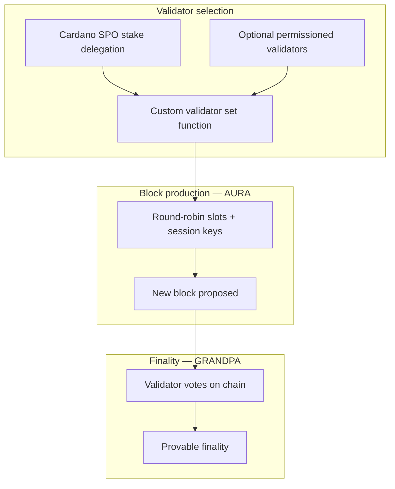
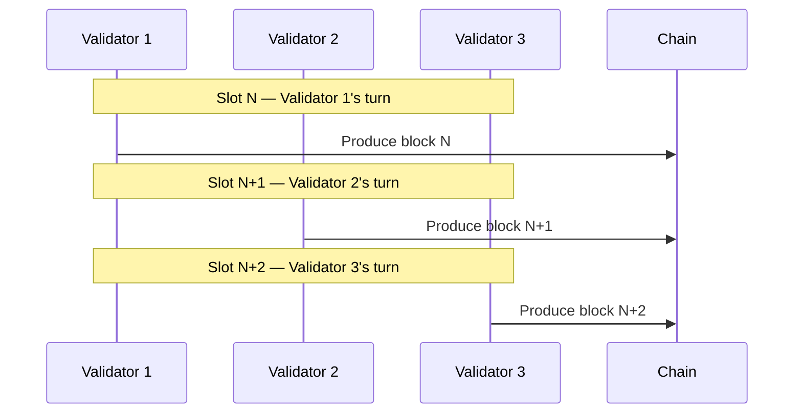
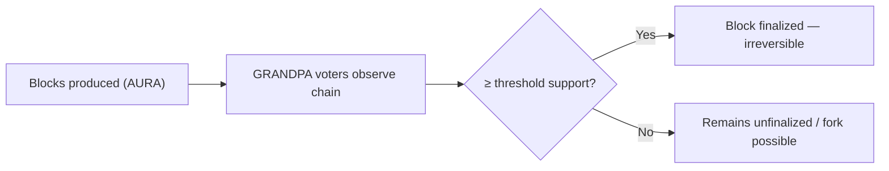

# Midnight Consensus

The Midnight Network uses a **modified Substrate consensus stack**: **AURA** for block production and **GRANDPA** for finality. Both are extended for Midnight as a **Cardano Partnerchain**.

## Architecture overview

---

## Validator selection

Unlike standard Substrate chains, Midnight uses a **custom validator set selection function** that:

- Accounts for **stake delegation from Cardano Stake Pool Operators (SPOs)**, letting existing Cardano validators participate in Midnight consensus.
- Supports **optional permissioned validators** for hybrid public/private network deployments.

| Model | Role |
|-------|------|
| SPO delegation | Bridges Cardano stake into Partnerchain validator eligibility |
| Permissioned set | Adds known operators for regulated or consortium networks |
| Custom selection | Combines both into the active session validator set |

---

## AURA: Block production

**AURA (Authority Round)** is a proof-of-authority (PoA) algorithm that determines which validator produces each block.

- Validators take turns in **round-robin** order.
- Scheduling uses **predefined slots** and **session keys**.
- Properties: simple, fast, deterministic — suited to high-throughput chains with known validator sets.

AURA is **not Midnight-specific**; it originated in OpenEthereum. See the [Polkadot protocol glossary — AURA](https://wiki.polkadot.network/docs/glossary#authority-round-aura).

**Signing:** Block authorship messages in AURA are signed with **sr25519** (see the Cryptography skill).

---

## GRANDPA: Finality

**GRANDPA (GHOST-based Recursive ANcestor Deriving Prefix Agreement)** provides **asynchronous, provable finality**.

- Operates **independently** of block production.
- Validators vote on chains; blocks finalize when they receive sufficient support.
- General-purpose Polkadot component — [formal specification](https://github.com/w3f/consensus/blob/master/pdf/grandpa.pdf) and [Polkadot glossary](https://wiki.polkadot.network/docs/glossary#ghost-based-recursive-ancestor-deriving-prefix-agreement-grandpa).

**Signing:** GRANDPA finality messages use **Ed25519**.

---

## How AURA and GRANDPA work together

| Layer | Responsibility | Midnight extension |
|-------|----------------|-------------------|
| AURA | Who builds the next block | Standard PoA over Partnerchain validator set |
| GRANDPA | Which blocks are final | Standard async finality gadget |
| Validator set | Who may participate | SPO delegation + optional permissioned operators |

**Key insight:** Block production can continue while GRANDPA finalizes earlier blocks asynchronously — throughput and safety are decoupled.

---

## Related skills

- `midnight-cryptography/` — signature schemes used by AURA and GRANDPA
- `midnight-onchain-logic/` — runtime pallets (`pallet-aura`, `pallet-grandpa`, session management)
- `midnight-p2p-networking/` — how validators discover and communicate
