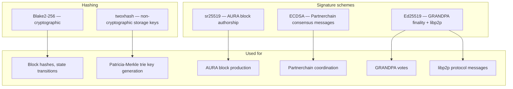
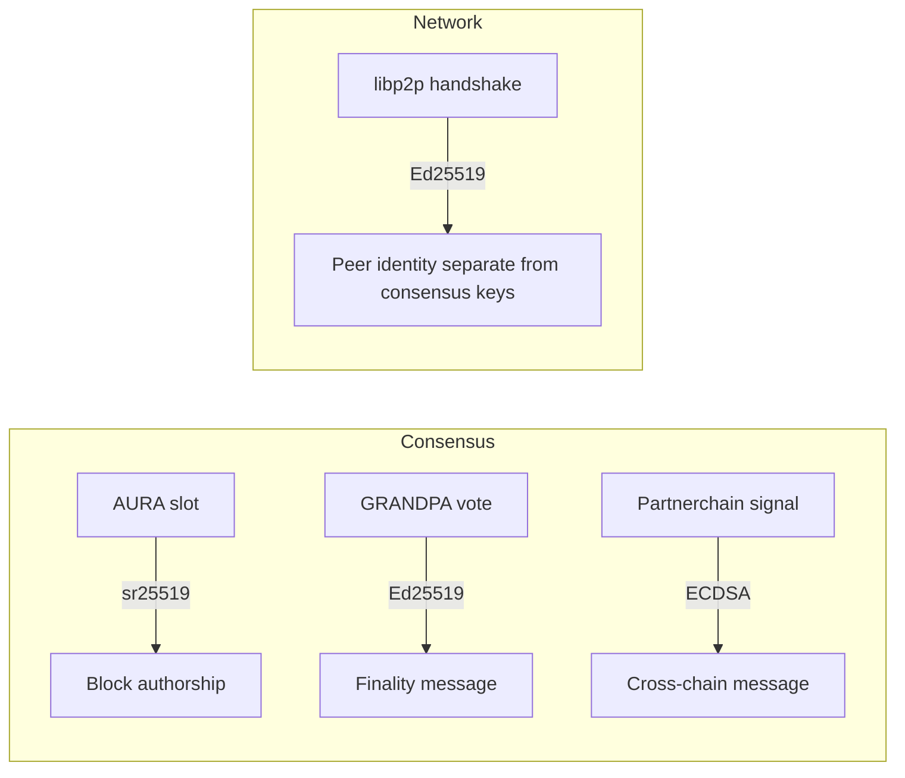

# Midnight Node Cryptography

Outside the **Midnight Ledger** (which has its own ZK circuits), the Midnight node relies on foundational cryptographic algorithms for **consensus**, **state transition integrity**, and **network communication**.

## Algorithm map

---

## Blake2-256 (primary hash)

**Blake2-256** is the primary cryptographic hash function on Midnight.

- Used for **block hashes** and general-purpose hashing in state transition functions.
- Balances **performance** and **security** for runtime-critical operations.

---

## Signature schemes

Midnight uses **three distinct schemes** depending on role:

| Scheme | Construction / basis | Used for |
|--------|---------------------|----------|
| **sr25519** | Schnorrkel + Ristretto x25519 | Signing **AURA block authorship** messages |
| **ECDSA** | Standard elliptic-curve ECDSA | Signing **Partnerchain-related consensus** messages (external interoperability) |
| **Ed25519** | Edwards-curve EdDSA | **GRANDPA finality** messages and **libp2p** protocol messages |

### sr25519

- Efficient key derivation and signature aggregation.
- Strong security guarantees for Substrate-style block production.

### ECDSA

- Ensures interoperability with systems where ECDSA is the standard (Partnerchain / Cardano ecosystem bridges).

### Ed25519

- Fast verification for high-frequency validator communication during finalization.
- Also used for **libp2p peer identity** (separate keypair from consensus signing keys).

---

## twoxhash (storage keys)

**twoxhash** is a **non-cryptographic** hash used to generate **storage keys** in the Patricia-Merkle trie.

- Optimized for **speed** and **low collision rates**.
- **Not** suitable for security-sensitive hashing.
- Significantly improves trie lookup performance.

See `midnight-storage/` for how twoxhash fits into ParityDB and state commitments.

---

## Ledger vs node crypto

| Layer | Cryptography |
|-------|-------------|
| **Midnight Ledger** | ZK proofs, ZSwap circuits, contract proof verification |
| **Midnight Node** | Blake2-256, sr25519, ECDSA, Ed25519, twoxhash |

Do not conflate ledger proof verification (handled by `pallet-midnight`) with node-level consensus and P2P primitives.

---

## Related skills

- `midnight-consensus/` — which schemes sign AURA vs GRANDPA vs Partnerchain messages
- `midnight-storage/` — twoxhash in trie key generation
- `midnight-p2p-networking/` — Ed25519 peer identity in libp2p
