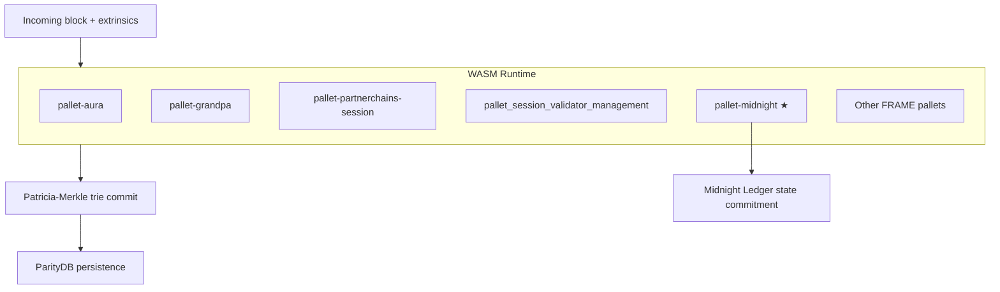
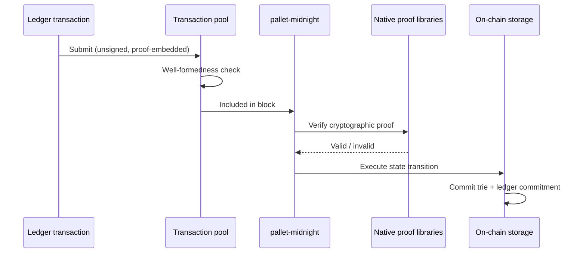

# Onchain Logic and State

The Midnight node follows the standard **Polkadot SDK** model: core logic (except native pre-compiles) compiles to **WebAssembly (WASM)** and forms the **runtime** — the state transition function executed identically on every node.

## Runtime architecture

---

## FRAME pallets

Each **FRAME pallet** encapsulates a domain of on-chain logic and may define:

- Storage (maps, multi-maps, lists, values)
- Events
- Dispatchable functions (transactions)
- Offchain workers
- Hooks
- Host-exposed functions
- RPC methods

This modular design is similar in spirit to a smart contract framework, but logic is **compiled ahead of time** and **governed at the chain level**.

---

## Key pallets on Midnight

| Pallet | Role |
|--------|------|
| `pallet-aura` | Block production via AURA |
| `pallet-grandpa` | Finality via GRANDPA |
| `pallet-partnerchains-session` | Session rotation in Partnerchain context |
| `pallet_session_validator_management` | Validator set coordination |
| **`pallet-midnight`** | **Core privacy-preserving transaction logic** |

---

## pallet-midnight: the ledger state machine

`pallet-midnight` is internally maintained and encapsulates the **Midnight Ledger** state machine.

### What it processes

- **ZSwap** asset transfers
- **Contract operations** (deploy, invoke)
- Specialized transactions from the Midnight Ledger format

### Validation model

- **Not** traditional signature-based dispatch for ledger txs.
- Each transaction embeds a **cryptographic proof** attesting validity.
- Native libraries verify proofs and execute corresponding state transitions.

### State commitment

After execution:

1. New state is committed on-chain.
2. Canonical ledger state lives in a **Patricia-Merkle trie** backed by a key-value database.
3. A **commitment to the full Midnight Ledger state** is persisted per block — tamper-proof and verifiable.

---

## Public vs ledger state

| State type | Where | Visibility |
|------------|-------|------------|
| Substrate runtime storage | Patricia-Merkle trie | Standard on-chain queries |
| Midnight Ledger commitment | Persisted per block | Verifiable snapshot of ledger |
| Contract ledger fields | Via `disclose()` in Compact | Selectively public per contract design |

For application-level privacy patterns, see `why-midnight/` and `compact/`.

---

## Related skills

- `midnight-consensus/` — AURA + GRANDPA pallets
- `midnight-transactions/` — transaction pool → runtime → commit lifecycle
- `midnight-storage/` — ParityDB + trie details
- `midnight-rpc/` — querying contract and ledger state via RPC
