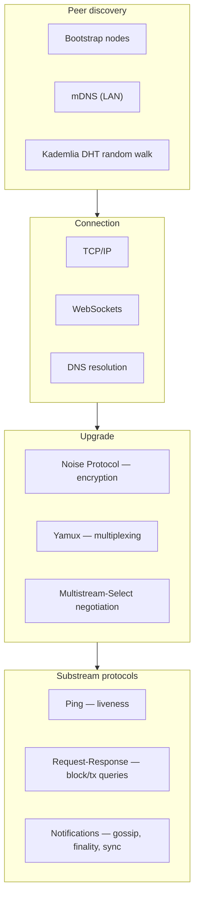
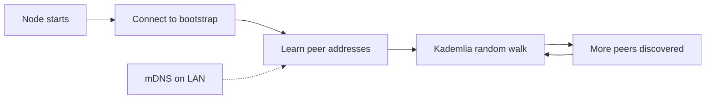
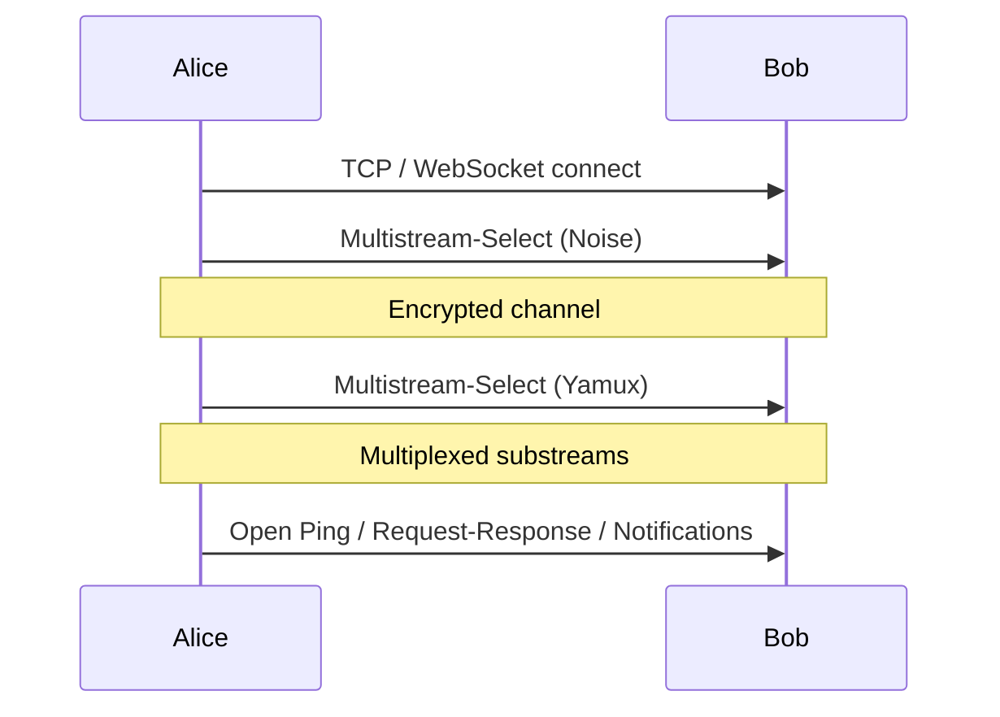

# P2P Networking

The **peer-to-peer (P2P) layer** connects Midnight nodes and enables data exchange across the decentralized network. Midnight uses the default **Polkadot SDK Rust libp2p** implementation.

## Stack overview

---

## Discovery mechanisms

To join the network, a node must **discover and connect to peers**.

### Bootstrap nodes

- Predefined **trusted peers** in network configuration (hard-coded identities + addresses).
- On startup, the node connects to bootstrap peers to join the network and learn about additional peers.

### mDNS (multicast DNS)

- Discovers peers on the **same LAN** via UDP broadcast.
- Useful for **development**, **testnets**, or co-located deployments.
- Enable/disable via network settings.

### Kademlia DHT (random walk)

- Once connected to at least one peer, the node performs a **Kademlia-based random walk** on each configured chain's DHT.
- Sends `FIND_NODE` queries to discover more peers.
- Builds a resilient, expanding view of the network over time.

---

## Connection establishment

After discovery, peers:

1. Establish **direct connections**.
2. **Negotiate shared protocol capabilities** (transport, security, multiplexing).

This foundation supports higher-level **sync** and **gossip** protocols.

---

## Transport layer

When node A (Alice) connects to node B (Bob):

| Transport | Description |
|-----------|-------------|
| **TCP/IP** | Traditional IPv4/IPv6 sockets |
| **WebSockets** | TCP + WebSocket framing (browser/proxy friendly) |
| **DNS** | Domain names resolved to IPs during connection |

---

## Encryption and multiplexing

After the base transport connects, peers upgrade via negotiated protocols:

| Protocol | Purpose |
|----------|---------|
| **Noise** | End-to-end confidentiality and integrity |
| **Yamux** | Multiple logical streams over one physical connection |
| **Multistream-Select** | Choose compatible encryption and multiplexing options |

---

## Substream protocols

Each substream runs a dedicated application-level protocol:

| Protocol | Purpose |
|----------|---------|
| **Ping** | Liveness checks and latency measurement |
| **Request-Response** | Structured exchange (block queries, transaction queries) |
| **Notifications** | Broadcast: new transactions, block announcements, finality updates, light-client state sync |

---

## Peer identification

- Each node has a unique **Ed25519 public key** for P2P identity.
- This keypair is **separate** from consensus message signing keys.
- Exchanged during handshake; used to authenticate peers for the session.

See `midnight-cryptography/` for Ed25519 usage in libp2p vs GRANDPA.

---

## Related skills

- `midnight-consensus/` — what validators gossip (blocks, finality)
- `midnight-cryptography/` — Noise, Ed25519 peer identity
- `midnight-rpc/` — external client access (complements P2P sync)
