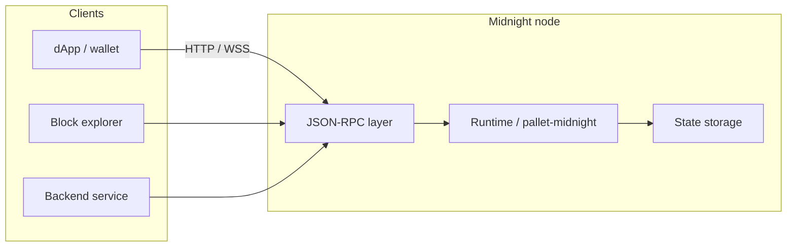
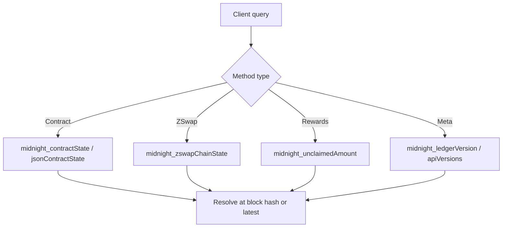
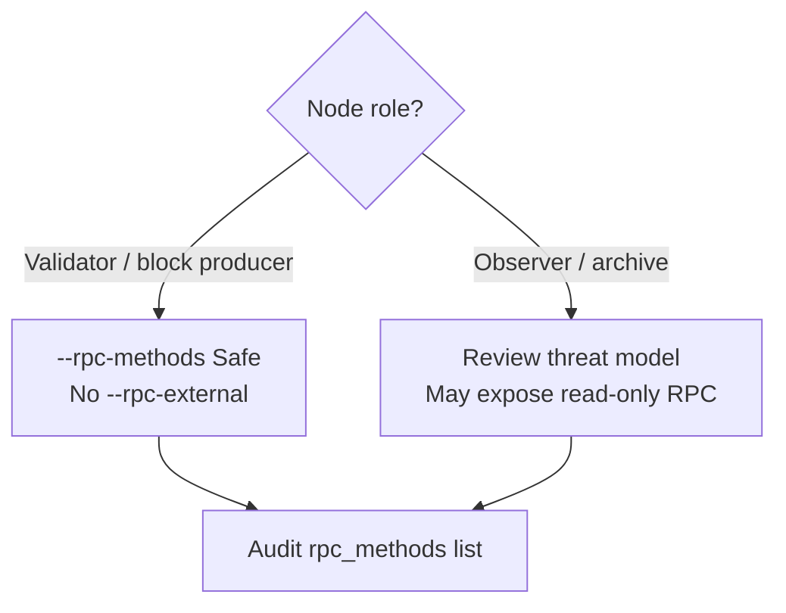

# RPC Interface

The **Remote Procedure Call (RPC)** layer lets external clients — dApps, wallets, explorers, services — interact with a running Midnight node over **HTTP/HTTPS** or **WebSocket**.

Midnight RPCs follow the **JSON-RPC** standard.

## Client ↔ node flow



### What RPC enables

- **Submitting transactions** (state transitions)
- **Querying on-chain contract state**
- **Fetching auxiliary data** (off-chain values, metadata)

---

## Core Midnight RPC methods

Custom methods focused on **ledger state**, **contract state**, and **system information**:

| Method | Purpose |
|--------|---------|
| `midnight_jsonContractState` | JSON-encoded smart contract state |
| `midnight_contractState` | Raw binary-encoded contract state at a block |
| `midnight_unclaimedAmount` | Unclaimed tokens/rewards for a beneficiary |
| `midnight_zswapChainState` | ZSwap chain state for a contract |
| `midnight_apiVersions` | Supported RPC API versions (tooling compatibility) |
| `midnight_ledgerVersion` | Ledger version at a block |

### Method signatures (reference)

```rust
#[method(name = "midnight_jsonContractState")]
fn get_json_state(
    &self,
    contract_address: String,
    at: Option<BlockHash>,
) -> Result<String, StateRpcError>;

#[method(name = "midnight_contractState")]
fn get_state(
    &self,
    contract_address: String,
    at: Option<BlockHash>,
) -> Result<String, StateRpcError>;

#[method(name = "midnight_unclaimedAmount")]
fn get_unclaimed_amount(
    &self,
    beneficiary: String,
    at: Option<BlockHash>,
) -> Result<u128, StateRpcError>;

#[method(name = "midnight_zswapChainState")]
fn get_zswap_chain_state(
    &self,
    contract_address: String,
    at: Option<BlockHash>,
) -> Result<String, StateRpcError>;

#[method(name = "midnight_apiVersions")]
fn get_supported_api_versions(&self) -> RpcResult<Vec<u32>>;

#[method(name = "midnight_ledgerVersion")]
fn get_ledger_version(&self, at: Option<BlockHash>) -> Result<String, BlockRpcError>;
```

Most methods accept an optional `at` block hash; omit for **latest** block.



---

## Polkadot SDK RPC support

Midnight also exposes default Polkadot SDK methods, including:

| Method | Purpose |
|--------|---------|
| `system_health` | Node health status |
| `chain_getBlock` | Fetch block by hash |
| `state_getStorage` | Read storage at a key |
| `rpc_methods` | List all supported RPC endpoints |

Call `rpc_methods` at any time for the full method list on your node.

> **Note:** Some Midnight RPC methods may not appear in Polkadot JS Apps. See [Polkadot SDK RPC docs](https://polkadot.js.org/docs/substrate/rpc) for overlap; support varies by node version and configuration.

For application-level reads, many dApps prefer the **Indexer GraphQL API** — see `midnight-indexer/`.

---

## Partnerchain RPCs

Midnight exposes **Partnerchain-specific** RPC methods for block producers and sidechain integration:

- Query **consensus signals**
- Relay **finality information**
- Coordinate **cross-chain** operations

---

## Security: block producers

> **Warning:** Not all RPC methods are safe to expose on public or production nodes.

If you run a **block-producing node**:

| Risk | Mitigation |
|------|------------|
| Sensitive data leakage | Use `--rpc-methods Safe` |
| External attack surface | Avoid `--rpc-external` unless required |
| Performance abuse | Limit exposed endpoints to your operational role |



Align RPC configuration with your **threat model** and role (validator vs observer).

---

## Related skills

- `midnight-onchain-logic/` — what state RPC methods read
- `midnight-indexer/` — GraphQL alternative for dApp data
- `midnight-transactions/` — submitting proof-based transactions via RPC
