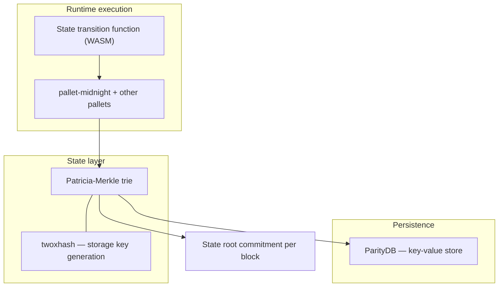
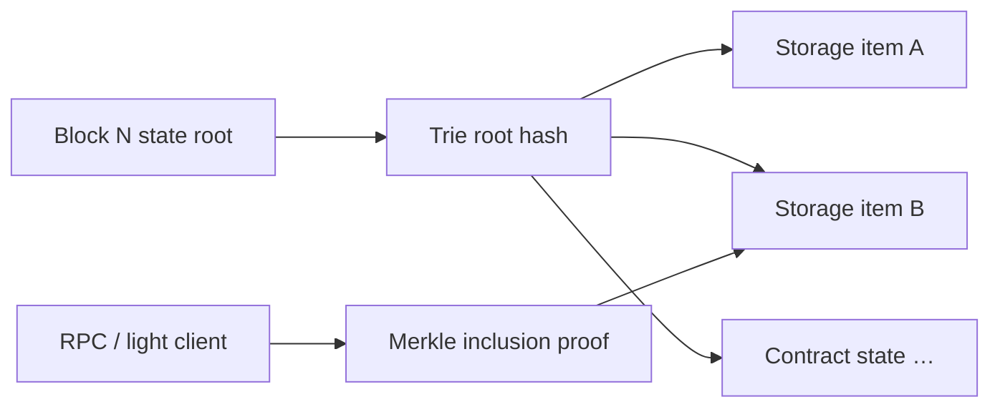
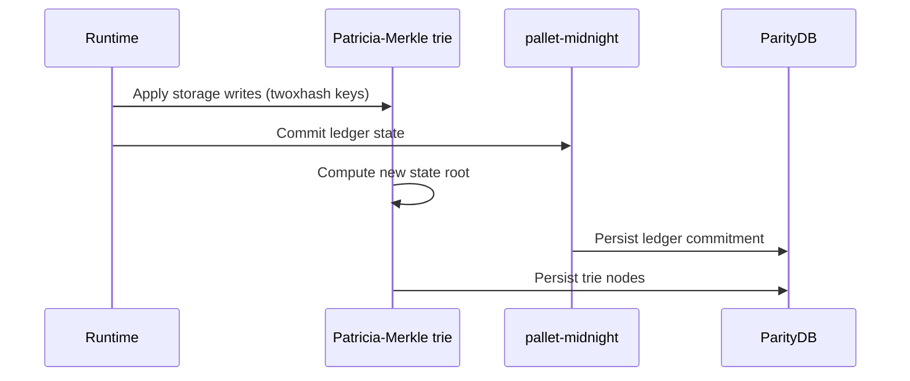

# Storage

Midnight is built on the **Polkadot SDK (Substrate)** and uses **ParityDB** as its default database backend.

## Storage stack

---

## ParityDB

**ParityDB** is a fast key-value store designed for blockchain workloads.

- Stores **all on-chain state**.
- Default backend for Substrate/Polkadot SDK chains including Midnight.
- Optimized for high write throughput during block import and state commits.

---

## Patricia-Merkle trie

The trie is the underlying data structure for **state commitments**.

| Property | Benefit |
|----------|---------|
| Merkle structure | Tamper-evident state root per block |
| Inclusion proofs | Efficient verification of contract state, balances, etc. |
| Incremental updates | Only changed paths recomputed per block |

Canonical ledger state from runtime pallets (including `pallet-midnight`) is organized in this trie and persisted via ParityDB.

---

## twoxhash (storage keys)

**twoxhash** generates **storage keys** within the trie.

| Aspect | Detail |
|--------|--------|
| Type | Non-cryptographic hash |
| Purpose | Fast internal key-value lookups |
| Properties | Speed, low collision rate |
| **Not for** | Security-sensitive hashing (use Blake2-256) |

twoxhash significantly improves trie performance for map lookups without the cost of cryptographic hashing on every key derivation.

See `midnight-cryptography/` for the full hash/signature split.

---

## State commit flow

Every block:

1. Runtime executes transactions and updates pallet storage.
2. Changed trie nodes are computed; **state root** is derived.
3. **Midnight Ledger commitment** is persisted alongside standard Substrate state (`pallet-midnight`).
4. ParityDB persists the updated trie backing store.

---

## Querying storage

| Access path | Use case |
|-------------|----------|
| `state_getStorage` (RPC) | Raw storage key reads |
| `midnight_contractState` (RPC) | Contract-specific state |
| Indexer GraphQL | Application-friendly contract/event queries |

---

## Related skills

- `midnight-onchain-logic/` — what gets written to storage
- `midnight-cryptography/` — Blake2-256 vs twoxhash
- `midnight-rpc/` — reading state via JSON-RPC
- `midnight-transactions/` — how txs trigger storage updates
