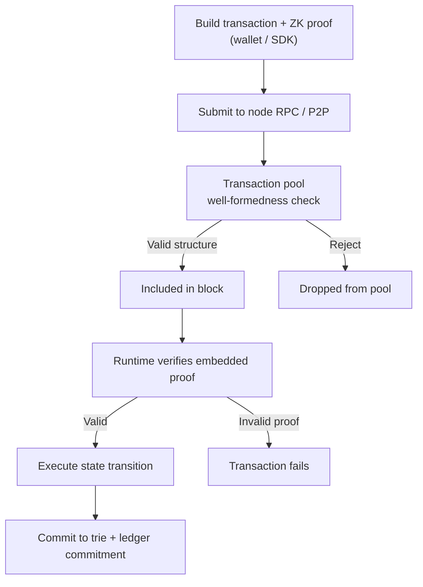
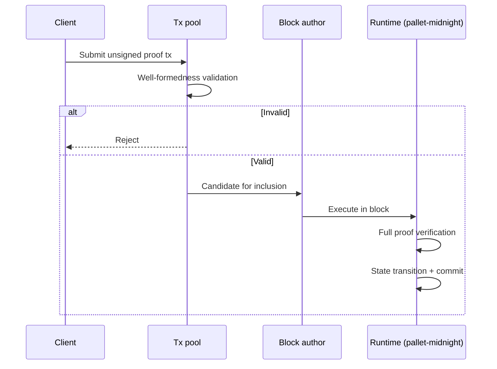

# Transactions

The Midnight node supports the standard **Polkadot SDK transaction format**, but default Substrate-style signed extrinsics are **uncommon in practice**. Midnight relies on a **proof-based verification model** tightly coupled with the Midnight Ledger.

## Lifecycle overview

---

## Proof-based model

Most Midnight transactions are **unsigned** and follow the **Midnight Ledger** format.

| Traditional chain | Midnight |
|-------------------|----------|
| Signature authorizes action | **Cryptographic proof** attests validity |
| Public signer identity | Sensitive data stays off-chain / in proof |
| Standard extrinsic format | Ledger-specific transaction envelope |

The proof lets the network validate state transitions **without** exposing sensitive data or raw signatures directly.

### Transaction types

- **Contract deployment**
- **Contract invocation** (circuit calls)
- **ZSwap** asset transfers

---

## Processing stages

### 1. Submission

Client (wallet, SDK, dApp) submits a transaction to a node's RPC or propagates via P2P gossip.

### 2. Transaction pool validation

The pool checks **well-formedness**:

- Structural requirements per runtime and ledger specification
- Logical preconditions (format, size, basic validity)
- **Not** full proof verification yet (that happens at block execution)

### 3. Block inclusion

A block producer (AURA validator) includes the transaction in a new block.

### 4. Runtime verification and execution

`pallet-midnight`:

1. **Fully verifies** the embedded cryptographic proof (native libraries).
2. If valid, **executes** the corresponding state transition.
3. **Commits** the updated state to on-chain storage.

### 5. Finality

Block may be **finalized** asynchronously via GRANDPA after inclusion.

---

## Comparison: pool vs runtime checks

| Check | Where | What |
|-------|-------|------|
| Well-formedness | Transaction pool | Structure, basic validity |
| Proof verification | Runtime (`pallet-midnight`) | Full cryptographic validation |
| State transition | Runtime | ZSwap / contract state update |
| Persistence | Storage layer | Trie + ledger commitment |

---

## Building and submitting txs (dApp context)

For application developers:

| Layer | Skill |
|-------|-------|
| Prove + submit txs | `midnight-js/`, `1am-wallet/` |
| Contract logic | `compact/` |
| Read results | `midnight-indexer/`, `midnight-rpc/` |

Node operators care about pool sizing, block limits, and RPC submission endpoints.

---

## Related skills

- `midnight-onchain-logic/` — `pallet-midnight` execution
- `midnight-storage/` — how commits are persisted
- `midnight-consensus/` — who includes txs in blocks
- `midnight-rpc/` — submission and state query endpoints
- `compact/` — what proofs attest to at the contract level
