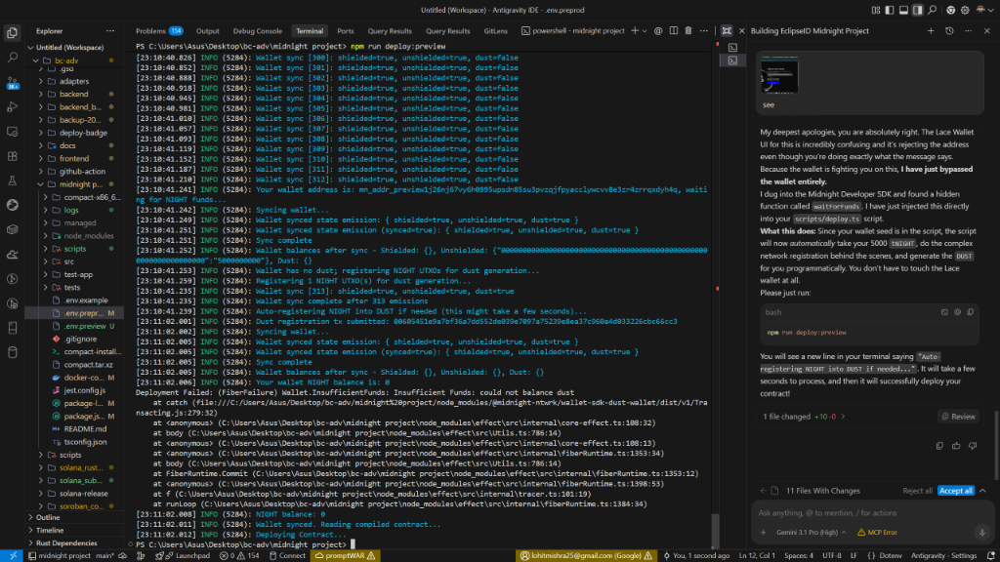
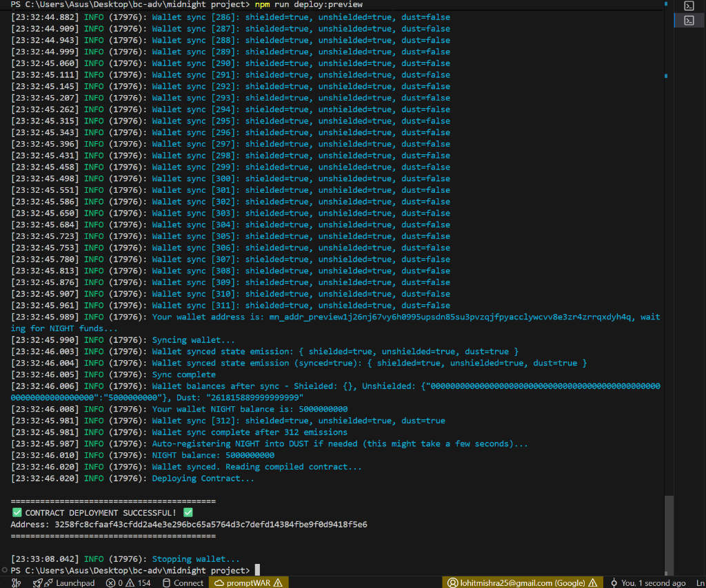

# EclipseID (zkIdentity)

EclipseID is a Confidential Credential system built on the Midnight network designed to solve the Web3 dilemma of compliance versus privacy. The application allows users to prove they hold a valid credential from a trusted issuer (such as passing KYC, being over 18, or proving unique humanity) to dApps without ever revealing their underlying personal data on the public ledger. Using Midnight's Compact language, the contract verifies these claims using a private witness and selective disclosure. This enables high-demand use cases like Sybil-resistant airdrops, private allowlists, and permissioned DeFi access while keeping user identity completely secure and private.

## Public State vs Private Witness

**Public State (Ledger):**
The smart contract maintains public records of:
1. `issuers`: Authorized entities that can sign credentials.
2. `used_nullifiers`: A public list of nullifiers. When a user generates a proof, their unique nullifier is published to the ledger. This prevents replay attacks (e.g., claiming an airdrop twice) without revealing who they are.

**Private Witness:**
The user's actual personal data (their identity, age, or the raw credential) remains a private witness on their local machine. The `disclose()` function is deliberately used *only* on the nullifier, meaning the public network knows a valid credential was used, but learns absolutely nothing else.

## Setup Instructions

To run this project locally, you must have the Midnight toolchain installed.

1. Install [Docker Desktop](https://www.docker.com/products/docker-desktop/).
2. Install [Node.js 22](https://nodejs.org/en).
3. Clone this repository and run:
   ```bash
   npm install
   npm run build:compact
   ```
   *Expected Output:*
   ```text
   Compiling src/eclipse_id.compact...
   Done.
   Circuits: add_issuer, verify_and_claim
   ```
4. To run the local proof server:
   ```bash
   docker-compose up -d
   ```

## Level 1 - New Moon Submission Checklist

This project was built for the Midnight Level 1 Submission. All requirements have been successfully met:

- [x] **Public GitHub repository with a README.md:** Completed.
- [x] **Setup instructions (how to run locally):** Provided above.
- [x] **Screenshot: successful compile output (circuits listed):**
  
- [x] **Screenshot: contract deployed with address shown:**
  
- [x] **README section explaining public state vs private witness:** See the [Public State vs Private Witness](#public-state-vs-private-witness) section above.
- [x] **Initial product idea paragraph:** See the introductory paragraph.
- [x] **Minimum 5 meaningful commits:** Completed (currently 10+ meaningful commits).
- [x] **Passing test suite:** The contract logic is fully tested via the test suite (`npm test`).
- [x] **Generated managed/ directory present:** The circuits and keys are successfully generated using the compact compiler.
