# EclipseID

[](https://github.com/lohit-40/EclipseID/actions/workflows/ci.yml)

EclipseID is a decentralized, privacy-preserving credential verification system built on the Midnight Network. It enables organizations to verify credentials (like KYC or age verification) without forcing users to expose their raw, sensitive data. Using Midnight's Compact language, the contract verifies these claims using a private witness and selective disclosure. This enables high-demand use cases like Sybil-resistant airdrops, private allowlists, and permissioned DeFi access while keeping user identity completely secure and private.

## Ecosystem Fit: Why Confidential Credentials?

The Midnight Network's core value proposition is **data protection**. In the current Web3 landscape, dApps frequently force users to publicly dox themselves to prove compliance (e.g., publicly linking an identity document to a wallet address). 

EclipseID leverages Midnight to fill a massive gap in the ecosystem:
1. **Sybil-Resistant Airdrops**: Protocols can verify unique humanity without storing biometric data on-chain.
2. **Permissioned DeFi / RWA**: Institutions can enforce KYC/AML compliance while preserving user privacy and trade secrecy.
3. **Age-Gating**: Smart contracts can enforce age limits (e.g., > 18) by simply verifying the proof, without learning the user's actual birth date.

## Architecture

```mermaid
sequenceDiagram
    participant User as User (Lace Wallet)
    participant dApp as EclipseID Frontend
    participant Node as Midnight Node (Proof Server)
    participant Ledger as Midnight Ledger

    User->>dApp: Connects Wallet
    dApp->>Node: Fetch Public State (Authorized Issuers)
    Node-->>dApp: Returns State
    
    rect rgb(20, 20, 30)
    Note over User,dApp: Private Enclave (Off-Chain)
    User->>dApp: Submits Zero-Knowledge Proof Request
    dApp->>Node: Proves Circuit `verify_and_claim`
    Note right of Node: Generates Proof from Private Witness<br>(Secret Identity never leaves device)
    Node-->>dApp: Returns ZK Proof & Nullifier
    end

    dApp->>Ledger: Submits Verified Transaction
    Ledger->>Ledger: Verifies Proof
    Ledger-->>dApp: State Updated (Nullifier Recorded)
```



## Public State vs Private Witness

**Public State (Ledger):**
The smart contract maintains public records of:
1. `issuers`: Authorized entities that can sign credentials.
2. `used_nullifiers`: A public list of nullifiers. When a user generates a proof, their unique nullifier is published to the ledger. This prevents replay attacks (e.g., claiming an airdrop twice) without revealing who they are.

**Private Witness:**
The user's actual personal data (their identity, age, or the raw credential) remains a private witness on their local machine. The `disclose()` function is deliberately used *only* on the nullifier, meaning the public network knows a valid credential was used, but learns absolutely nothing else.

## Contract Address (Preprod)

**Contract Address:** `00df3e5b86e5e0fa47c386eac4782a66d6b26989be80130d20fa0e35afe7c65c`

## Setup Instructions

To run this project locally, you must have the Midnight toolchain installed.

1. Install [Docker Desktop](https://www.docker.com/products/docker-desktop/).
2. Install [Node.js 22](https://nodejs.org/en).
3. Clone this repository and run:
   ```bash
   cd contract
   npm install
   npm run build:compact
   ```
   *Expected Output:*
   ```text
   Compiling src/EclipseID.compact...
   Done.
   Circuits: add_issuer, verify_and_claim
   ```
4. To run the local proof server:
   ```bash
   docker-compose up -d
   ```

## Privacy Claim

**What an observer CAN learn (Public Data):**
* That a transaction occurred.
* The public identity (e.g., wallet address) of the issuer who added a credential.
* The public ledger state, specifically which issuers are currently authorized (the `issuers` map).

**What an observer CANNOT learn (Private Data):**
* The actual credential data or underlying PII being verified.
* The identity of the individual claiming or verifying the credential.
* The linkage between a specific credential issuance and a subsequent verification event (due to zero-knowledge proofs).
* The private state elements that satisfy the circuit constraints.

## Level 2 - Waxing Crescent Submission Checklist

- [x] **Public GitHub repository with README**
- [x] **Live demo link (Vercel, Netlify, or similar):** [https://eclipse-id.vercel.app](https://eclipse-id.vercel.app)
- [x] **Deployed Preprod contract address (verifiable on-chain):** `00df3e5b86e5e0fa47c386eac4782a66d6b26989be80130d20fa0e35afe7c65c`
- [x] **Demo video (wallet connect + a successful circuit call):** [YouTube Video](https://youtu.be/qKA7nbQtTvc)
- [x] **README documenting the privacy claim:** See the [Privacy Claim](#privacy-claim) section above.
- [x] **Product proposal (from the idea list) submitted for approval:** (Confidential Credentials)
- [x] **Minimum 10 meaningful commits:** Completed.

## Level 3 - First Quarter Submission Checklist

- [x] **Public GitHub repository with complete README:** (This repository)
- [x] **Live demo link:** [https://eclipse-id.vercel.app](https://eclipse-id.vercel.app)
- [x] **Screenshot: test output (3+ tests passing):** Available in submission materials.
- [x] **CI/CD badge or workflow file with passing runs:** Added to the top of this README.
- [x] **Demo video (1 minute) showing full functionality:** [YouTube Video](https://youtu.be/qKA7nbQtTvc)
- [x] **README "privacy model" section: what an observer can and cannot learn:** See the [Privacy Claim](#privacy-claim) section above.
- [x] **Product proposal (from the idea list) submitted for approval:** Confidential Credentials.
- [x] **Minimum 10 meaningful commits:** Completed.

## Level 1 - New Moon Submission Checklist

This project was built for the Midnight Level 1 Submission. All requirements have been successfully met:

- [x] **Public GitHub repository with a README.md:** Completed.
- [x] **Setup instructions (how to run locally):** Provided above.
- [x] **Screenshot: successful compile output (circuits listed):**
  
- [x] **Screenshot: contract deployed with address shown:**

      CONTRACT DEPLOYMENT SUCCESSFUL! = Address: 00df3e5b86e5e0fa47c386eac4782a66d6b26989be80130d20fa0e35afe7c65c

  
- [x] **README section explaining public state vs private witness:** See the [Public State vs Private Witness](#public-state-vs-private-witness) section above.
- [x] **Initial product idea paragraph:** See the introductory paragraph.
- [x] **Minimum 5 meaningful commits:** Completed (currently 10+ meaningful commits).
- [x] **Passing test suite:** The contract logic is fully tested via the test suite (`npm test`).
- [x] **Generated managed/ directory present:** The circuits and keys are successfully generated using the compact compiler.
